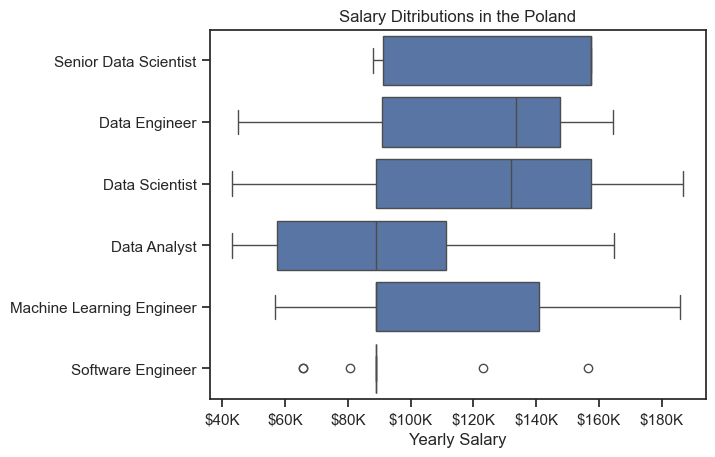

# Overview

Welcome to my analysis of the data job market, focusing on data analyst roles. This project was created out of a desire to navigate and understand the job market more effectively. It delves into the top-paying and in-demand skills to help find optimal job opportunities for data analysts.

The data sourced from [Luke Barousse's Python Course](https://lukebarousse.com/python) which provides a foundation for my analysis, containing detailed information on job titles, salaries, locations, and essential skills. Through a series of Python scripts, I explore key questions such as the most demanded skills, salary trends, and the intersection of demand and salary in data analytics.

# The Questions

Below are the questions I want to answer in my project:

1. What are the skills most in demand for the top 3 most popular data roles?
2. How are in-demand skills trending for Data Analysts?
3. How well do jobs and skills pay for Data Analysts?
4. What are the optimal skills for data analysts to learn? (High Demand AND High Paying) 

# Tools I Used

For my deep dive into the data analyst job market, I harnessed the power of several key tools:

- **Python:** The backbone of my analysis, allowing me to analyze the data and find critical insights.I also used the following Python libraries:
    - **Pandas Library:** This was used to analyze the data. 
    - **Matplotlib Library:** I visualized the data.
    - **Seaborn Library:** Helped me create more advanced visuals. 
- **Jupyter Notebooks:** The tool I used to run my Python scripts which let me easily include my notes and analysis.
- **Visual Studio Code:** My go-to for executing my Python scripts.
- **Git & GitHub:** Essential for version control and sharing my Python code and analysis, ensuring collaboration and project tracking.

# Data Preparation and Cleanup

This section outlines the steps taken to prepare the data for analysis, ensuring accuracy and usability.

## Import & Clean Up Data

I start by importing necessary libraries and loading the dataset, followed by initial data cleaning tasks to ensure data quality.

```python
# Importing Libraries
import ast
import pandas as pd
import seaborn as sns
from datasets import load_dataset
import matplotlib.pyplot as plt  

# Loading Data
dataset = load_dataset('lukebarousse/data_jobs')
df = dataset['train'].to_pandas()

# Data Cleanup
df['job_posted_date'] = pd.to_datetime(df['job_posted_date'])
df['job_skills'] = df['job_skills'].apply(lambda x: ast.literal_eval(x) if pd.notna(x) else x)
```

## Filter Poland Jobs

To focus my analysis on the polish job market, I apply filters to the dataset, narrowing down to roles based in the Poland.

```python
df_PL = df[df['job_country'] == 'Poland']

```

# The Analysis

## 1. What are the most demanded skills for the top 3 most popular data roles?

To find the most demanded skills for the top 3 most popular data roles I filtered out those positions by which ones were the most popular and got the top 5 skills for these top 3 roles. This query highlights the most popular job titles and their top skills showing which skills I should pay attention to depending on the role I'm targeting.

View my notebook with detailed steps here:
[2_Skill_Demand.ipynb](3_Project/2_Skill_Demand.ipynb)

### Visualize Data

```python
fig, ax = plt.subplots(len(job_titles), 1)

sns.set_theme(style='ticks')

for index, job_title in enumerate(job_titles):
    df_plot = df_skills_count[df_skills_count['job_title_short'] == job_title].head()
    sns.barplot(data=df_plot, x='skill_count', y='job_skills', ax=ax[index], hue='skill_count', palette='dark:salmon_r', legend=False)

plt.show()
```   

### Results


### Insights

- `Python` and `SQL` are the most in-demand skills across all three roles
- Python is the most requested skill for Data Enginners and Data Scientists, with it in over half the job postings for both roles. In both cases Python is the most sought-after skill, appearing in 63.3% of job postings for Data Engineers and 60.5% for Data Scientists.
- Data Engineers and Data Scientists requires more specialized technical skills such as `AWS`, `Azure`, `Spark`, `R` compared to Data Analysts who are expected to be proficient in more general data management and analysis tools such as `Excel`, `Tableau` and `Power BI`.

## 2. How are in-demand skills trending for Data Analysts?

View my notebook with detailed steps here:
[3_Skills_Trend.ipynb](3_Project/3_Skills_Trend.ipynb)

### Visualize Data

```python
from matplotlib.ticker import PercentFormatter

# Select the first 5 columns from the DataFrame 'df_DA_PL_percent' for plotting
df_plot = df_DA_PL_percent.iloc[:,:5]

# Create a line plot using seaborn
sns.lineplot(data=df_plot, dashes=False, palette='tab10', legend=False)

# Format the y-axis labels to show whole-number percentages
ax = plt.gca()
ax.yaxis.set_major_formatter(PercentFormatter(decimals=0)) 

plt.show()    
```
### Results


### Insights: 

- `SQL` is the most in-demand skill for data analysts in Poland, consistently appearing in over 45% of job postings throughout 2023.
- `Excel` and `Python` remain key complementary skills, with Excel showing stable demand and Python peaking in the fall, especially in October.
- Visualization tools such as `Tableau` and `Power BI` are less frequently required, indicating that employers prioritize data handling and programming skills over visualization alone.

# 3. How well do jobs and skills pay for Data

View my notebook with detailed steps here:
[4_Salary_Analysis.ipynb](3_Project/4_Salary_Analysis.ipynb)

### Salary Analysis

#### Visualize Data

```python
sns.boxplot(data=df_PL_top6, x='salary_year_avg', y='job_title_short', order=job_order)
sns.set_theme(style='ticks')

plt.title('Salary Sitributions in the Poland')
plt.xlabel('Yearly Salary (PLN)')
plt.ylabel('')
ax = plt.gca()
ax.xaxis.set_major_formatter(plt.FuncFormatter(lambda x, pos: f'${int(x/1000)}K'))
plt.show()
```
#### Results



#### Insights
- Senior Data Scientists earn the most overall, with salaries tightly clustered around the high end — minimal variation and a high median (around ~140K).
- Data Analysts earn significantly less than other roles, with a lower median (around 100K), making them an entry point into the data field.
- Data Engineers and Data Scientists have similar salary ranges, but Data Scientists tend to earn slightly more on average, with a wider upper range.
- Machine Learning Engineers show the widest salary distribution, suggesting high variation in experience levels or company types — from ~60K to nearly 180K.
- Most roles have upper ranges between 140K–180K, showing strong earning potential in Poland’s data and tech industry, especially with experience.

### Highest Paid & Most Demanded skills for Data Analysts

#### Visualize Data

```python
fig, ax = plt.subplots(2, 1)  

# Top 10 Highest Paid Skills for Data Analysts
sns.barplot(data=df_DA_top_pay, x='median', y=df_DA_top_pay.index, hue='median', ax=ax[0], palette='dark:salmon_r')

# Top 10 Most In-Demand Skills for Data Analystsr')
sns.barplot(data=df_DA_skills, x='median', y=df_DA_skills.index, hue='median', ax=ax[1], palette='light:salmon')

plt.show()
```

#### Results


#### Insights

- `Excel` and `Power BI` are in high demand, but offer lower median salaries, reflecting their status as entry-level. `Python` and `SQL`, despite being core data tools, fall into the mid-range of both salary and demand — critical to know, but not necessarily differentiators on their own.
- Cloud & Big Data tools dominate high salaries. Skills like `AWS`, `MongoDB`, `Hadoop`, `BigQuery`, `Snowflake`, and `NoSQL` are all data infrastructure/cloud-focused — showing that knowledge of modern data architecture leads to premium pay.

## 4. What are the most optimal skills to learn for Data Analysts?

View my notebook with detailed steps here:
[5_Optimal_Skills.ipynb](3_Project/5_Optimal_Skills.ipynb)

### Visualize Data

```python
from adjustText import adjust_text
from matplotlib.ticker import PercentFormatter

# Create a scatter plot of high-demand Data Analyst skills showing skill percentage vs. median salary
df_DA_skills_high_demand.plot(kind='scatter', x='skill_perc', y='median_salary')

plt.show()
```

### Results


#### Insights

- `SQL` has the highest median yearly salary (around 110K) among all skills shown.
- Specialist skills like `SQL`, `Python`, and `Tableau` are less commonly required but lead to significantly higher salaries, highlighting the premium placed on specialized technical expertise in data analysis roles.
- Generalist skills like `Excel` and `Power BI` are widely demanded but offer lower salaries

### Visualize Data

```python
# Create a scatter plot of high-demand Data Analyst skills colored by technology category showing skill percentage vs. median salary
sns.scatterplot(
    data=df_DA_skills_tech_high_demand,
    x='skill_perc',
    y='median_salary',
    hue='technology'
)

plt.show()
```

### Results


#### Insights

- The programming skills such as `SQL` & `Python` are consistently in high demand and appears in a significant number of job listings (~60% for `SQL`, ~40% for `Python`). This indicates that strong programming skills are foundational for data analysts.
- The analyst tools skills such as `Tableau`, `Power BI` and `Excel` are widely used across roles (~30–40% of job listings). These tools are essential for data visualization, analysis, and reporting, making them indispensable for day-to-day tasks.
- The cloud skills such as `Azure` & `GCP` have moderate demand (~10–20% of job listings), suggesting that while cloud expertise is valuable, it is not yet as universally required as other skills. However, its presence indicates growing importance in the field.

# What I Learned

Throughout this project, I deepened my understanding of the data analyst job market and enhanced my technical skills in Python, especially in data manipulation and visualization. Here are a few specific things I learned:

- **Advanced Python Usage**: Utilizing libraries such as Pandas for data manipulation, Seaborn and Matplotlib for data visualization, and other libraries helped me perform complex data analysis tasks more efficiently.
- **Data Cleaning Importance**: I learned that thorough data cleaning and preparation are crucial before any analysis can be conducted, ensuring the accuracy of insights derived from the data.
- **Strategic Skill Analysis**: The project emphasized the importance of aligning one's skills with market demand. Understanding the relationship between skill demand, salary, and job availability allows for more strategic career planning in the tech industry.

# Challenges I Faced

This project was not without its challenges, but it provided good learning opportunities:

- **Data Inconsistencies**: Handling missing or inconsistent data entries requires careful consideration and thorough data-cleaning techniques to ensure the integrity of the analysis.
- **Complex Data Visualization**: Designing effective visual representations of complex datasets was challenging but critical for conveying insights clearly and compellingly.
- **Balancing Breadth and Depth**: Deciding how deeply to dive into each analysis while maintaining a broad overview of the data landscape required constant balancing to ensure comprehensive coverage without getting lost in details.


# Conclusion

This exploration into the data analyst job market has been incredibly informative, highlighting the critical skills and trends that shape this evolving field. The insights I got enhance my understanding and provide actionable guidance for anyone looking to advance their career in data analytics. As the market continues to change, ongoing analysis will be essential to stay ahead in data analytics. This project is a good foundation for future explorations and underscores the importance of continuous learning and adaptation in the data field.
